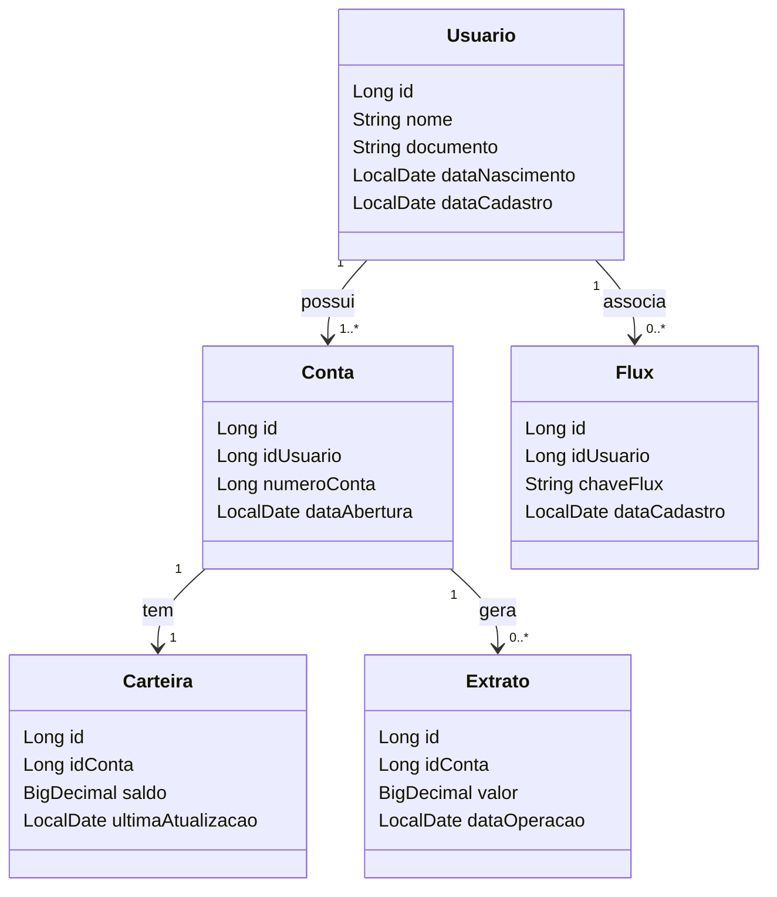

# drawer-flutter

# Class Diagram

```mermaid
classDiagram
    class Usuario {
        Long id
        String nome
        String documento
        LocalDate dataNascimento
        LocalDate dataCadastro
    }

    class Conta {
        Long id
        Long idUsuario
        Long numeroConta
        LocalDate dataAbertura
    }

    class Carteira {
        Long id
        Long idConta
        BigDecimal saldo
        LocalDate ultimaAtualizacao
    }

    class Extrato {
        Long id
        Long idConta
        BigDecimal valor
        LocalDate dataOperacao
    }

    class Flux {
        Long id
        Long idUsuario
        String chaveFlux
        LocalDate dataCadastro
    }

    Usuario "1" --> "1..*" Conta : possui
    Conta "1" --> "1" Carteira : tem
    Conta "1" --> "0..*" Extrato : gera
    Usuario "1" --> "0..*" Flux : associa
```